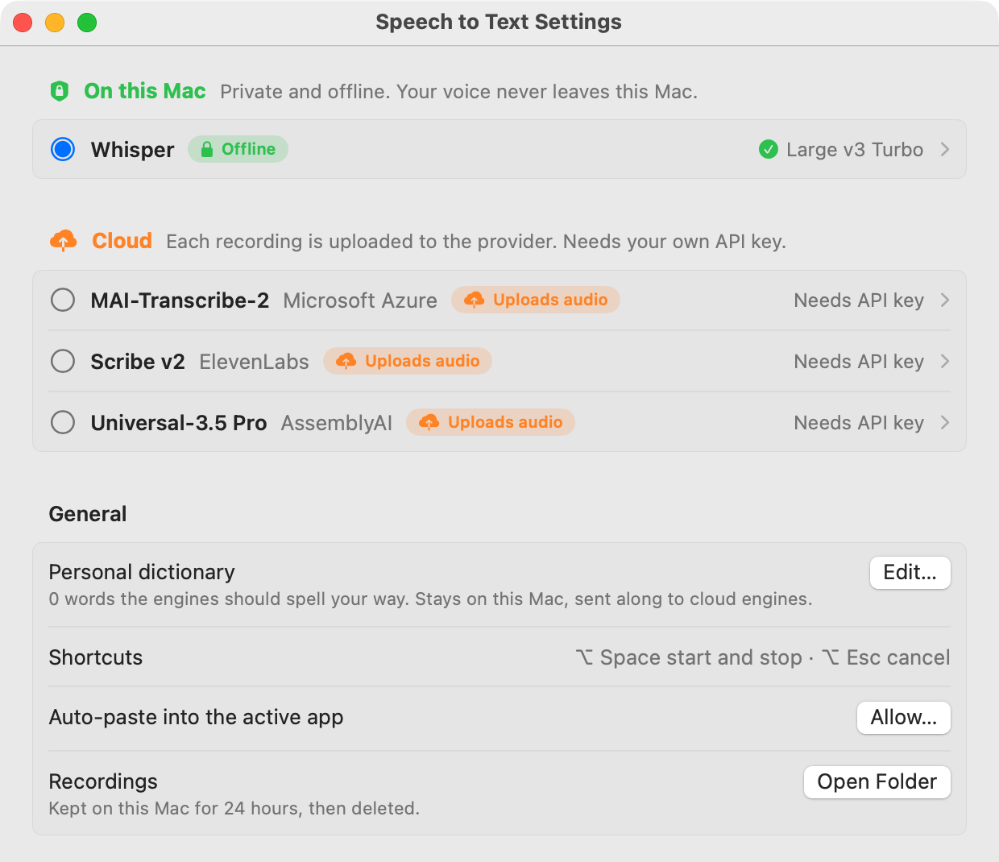

# Speech to Text

Free, open-source dictation for your Mac's menu bar.

Press **⌥ Space** anywhere, speak, press **⌥ Space** again. Your words are typed into the app you are using and copied to the clipboard.

You choose where the speech is turned into text: **privately on your own Mac**, or with a **cloud service** you bring your own key for. The app always shows which one is active.



## Where does my voice go?

| Engine | Where your audio goes | What you need |
|---|---|---|
| 🔒 **Whisper** (on this Mac) | **Nowhere.** It is transcribed on your Mac and works without internet. | A one-time model download in Settings (148 MB to 1.6 GB) |
| ☁️ **MAI-Transcribe-2** | Uploaded to **Microsoft Azure** | Your own Azure Speech key and endpoint |
| ☁️ **Scribe v2** | Uploaded to **ElevenLabs** | Your own ElevenLabs API key |
| ☁️ **Universal-3.5 Pro** | Uploaded to **AssemblyAI** | Your own AssemblyAI API key |

How you can tell at a glance:

- Settings groups the engines under a green **On this Mac** heading and an orange **Cloud** heading. Every cloud engine says which company receives the audio.
- While you record, the overlay shows a badge: **🔒 On this Mac** or **☁️ Cloud · ElevenLabs** (or whichever provider you picked).
- The menu bar's Engine menu is split the same way.

Everything else stays on your Mac too:

- **Recordings** are saved locally for 24 hours so nothing is lost if a transcription fails, then deleted automatically.
- **API keys** are stored in your macOS Keychain, never in a plain file.
- **Your personal dictionary** is a local file that is never part of this repository.
- **No analytics, no telemetry, no account.** The app only goes online to download a model when you click Download, and to reach the cloud engine you selected.

If you dictate anything confidential at work, use Whisper, or check your company's rules for the cloud provider first.

## Install

You need a Mac with **macOS 14 or newer**. The ready-made download is for Apple Silicon Macs (M1 or later). On an Intel Mac, build it yourself with option 2.

### Option 1: Download the app

1. Download `SpeechToText.zip` from the [latest release](https://github.com/JDrechsler/speech-to-text/releases/latest) and unzip it.
2. Drag **SpeechToText** into your **Applications** folder.
3. Open it. macOS will say it cannot verify the developer, because this free app is not notarized by Apple. Click **Done**, then go to **System Settings → Privacy & Security**, scroll down and click **Open Anyway** next to SpeechToText.

### Option 2: Build it yourself

```bash
xcode-select --install          # once, if you have never installed the developer tools
git clone https://github.com/JDrechsler/speech-to-text.git
cd speech-to-text
./build.sh --run                # builds, installs to /Applications and starts it
```

## First start

1. **Settings opens by itself** with the Whisper row open. Click **Download** next to **Large v3 Turbo (compact)**. It is the recommended model: 574 MB, very accurate, 99 languages.
2. Press **⌥ Space**, say something, press **⌥ Space** again.
3. Allow **Microphone** access when macOS asks.
4. Allow **Accessibility** when macOS asks. This lets the app paste the text for you. Without it the text is still copied to the clipboard and you paste with ⌘V.

Open Settings again any time from the menu bar icon → **Settings…** (⌘,).

### Which Whisper model?

| Model | Download | Good for |
|---|---|---|
| Base | 148 MB | Quick tests, clear English |
| Small | 488 MB | Older or smaller Macs |
| **Large v3 Turbo (compact)** | 574 MB | **Most people.** Near-best accuracy, 99 languages |
| Large v3 Turbo | 1.6 GB | The best accuracy, about 2 GB of memory while the app runs |

The language is detected automatically. If it guesses wrong on short recordings, pick your language under **Spoken language**.

## Using a cloud engine (optional)

Cloud engines can be faster on older Macs and handle some accents or mixed languages better. Each provider bills you for your usage on your own account.

Open **Settings**, click the provider's row to open it, paste your key and click **Save**. Then click the round button in front of it to use it.

- **ElevenLabs Scribe v2:** create a key at [elevenlabs.io → Developers → API keys](https://elevenlabs.io/app/developers/api-keys).
- **AssemblyAI Universal-3.5 Pro:** copy your key from the [AssemblyAI dashboard](https://www.assemblyai.com/dashboard/api-keys).
- **Microsoft MAI-Transcribe-2:** in the Azure portal, create a Speech resource in a region that offers MAI-Transcribe (see [Microsoft's MAI-Transcribe guide](https://learn.microsoft.com/azure/ai-services/speech-service/mai-transcribe)). Copy **Key 1** and the **endpoint** (`https://<resource-name>.cognitiveservices.azure.com`) into Settings.

A cloud request that fails because of a network hiccup or a busy server is tried up to 3 times. A wrong key is reported right away.

## Everyday use

| Action | How |
|---|---|
| Start, stop and paste | ⌥ Space |
| Cancel the current recording | ⌥ Esc |
| See, replay, copy or re-transcribe the last 24 hours | Menu bar icon → History… |
| Choose a microphone | Menu bar icon → Microphone |
| Pause music and videos while you talk | Menu bar icon → Pause Media While Recording |
| Start with your Mac | Menu bar icon → Launch at Login |

### Personal dictionary

Teach the engines names and jargon they keep misspelling: menu bar icon → **Edit Dictionary…**. Write one word or name per line, exactly as you want it spelled. It starts empty and lives only on your Mac.

Keep it short, 50 entries at most. Rare names and product terms help, common words do not. Cloud engines receive these words with each recording.

## Where things are stored

| What | Where |
|---|---|
| Whisper models | `~/Library/Application Support/SpeechToText/models/` |
| Recordings (kept 24 hours) | `~/Library/Application Support/SpeechToText/recordings/` |
| Personal dictionary | `~/Library/Application Support/SpeechToText/dictionary.txt` |
| API keys | macOS Keychain, items named "Speech to Text: …" |
| Error log (no transcripts) | `~/Library/Logs/SpeechToText/app.log` |

To remove everything, quit the app, delete it from Applications, delete the two `SpeechToText` folders above, and remove the "Speech to Text" items in Keychain Access.

## Permissions after rebuilding

macOS ties the Microphone and Accessibility permissions to the app's signature. A self-built app is signed "ad hoc", so **every rebuild asks for the permissions again**, and the Keychain may ask once whether the app may read your keys.

If you rebuild often, create a stable signing certificate once: open **Keychain Access → Certificate Assistant → Create a Certificate…**, name it exactly `SpeechToText Dev`, choose **Code Signing** as the type, and create it. `build.sh` uses it automatically from then on.

## Let an AI agent set it up

This repository contains a [`CLAUDE.md`](CLAUDE.md) (also readable as `AGENTS.md`) that tells coding agents like Claude Code how to build the app, download models and configure engines for you. Open the folder in your agent and ask it to "set up Speech to Text for me".

## Credits

- [whisper.cpp](https://github.com/ggml-org/whisper.cpp) by Georgi Gerganov and contributors runs the offline engine (MIT).
- The Whisper models are by OpenAI (MIT), converted for whisper.cpp and downloaded from [Hugging Face](https://huggingface.co/ggerganov/whisper.cpp).
- [mediaremote-adapter](https://github.com/ungive/mediaremote-adapter) by Jonas van den Berg pauses and resumes media playback (BSD 3-Clause, included in `vendor/`).

## License

[MIT](LICENSE). Use it, change it, share it.
